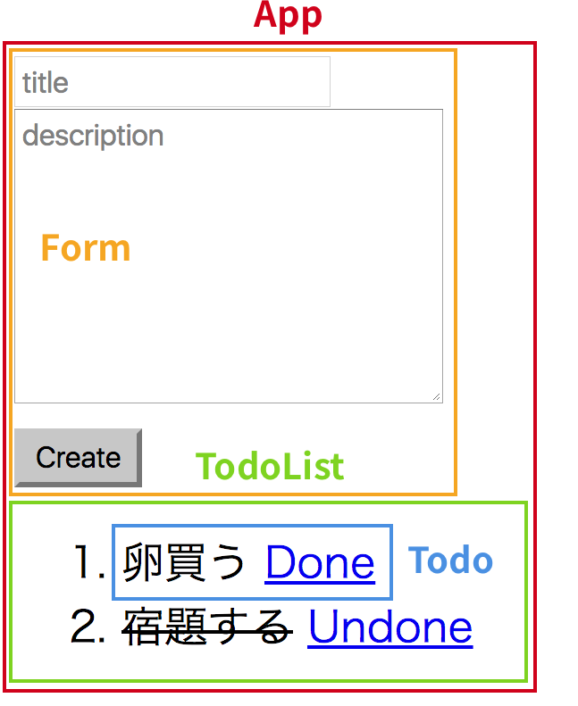

これまで何度かReactを触ってきましたが、
今回はこれまでの復習がてら、ありがちですがTODOアプリを作ってみます。

今回の完成形はこんな感じ↓

[todo-app](/playground/todo-app/)

## **1. 設計図を描く**

最初にコンポーネントの構成を考えます。

今回はこんな感じでいってみます。

TODOリスト全体の状態管理は`App`コンポーネントでやって、
各TODOのそれは`Todo`コンポーネントでやることにします。

## **2. 実装**

実装は次のようになります。

※これ以外にエントリーポイントのJSやCSSが必要になります。

<code class="gist-code" data-gist-id="84fcb8f20c23d26fd1cc22b39de13398" data-gist-file="App.js" data-gist-enable-cache="true"></code>

<code class="gist-code" data-gist-id="84fcb8f20c23d26fd1cc22b39de13398" data-gist-file="Form.js" data-gist-enable-cache="true"></code>

<code class="gist-code" data-gist-id="84fcb8f20c23d26fd1cc22b39de13398" data-gist-file="TodoList.js" data-gist-enable-cache="true"></code>

<code class="gist-code" data-gist-id="84fcb8f20c23d26fd1cc22b39de13398" data-gist-file="Todo.js" data-gist-enable-cache="true"></code>

## **3. おわりに**

以上、簡単なTODOアプリを作ってみました。

今回、せっかく用意したTODOのdescriptionフィールドを使っていないのですが、
これは次回[react-router](https://github.com/ReactTraining/react-router)の練習を兼ねて使う予定です。
