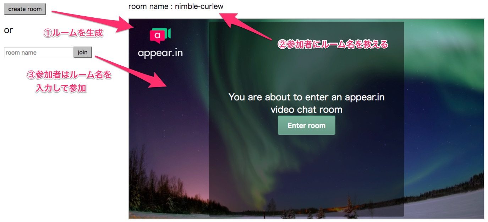

[appear.in](https://appear.in/)という手軽にビデオチャットができるサービスがあります。

最近、自分のサイトに簡単に埋め込める API があるのを知ったので、ちょっと使ってみました。

ドキュメントは[こちら](https://developer.appear.in/)

## **1. サンプルアプリ**

チャットルームを生成して、そのルーム参加者とビデオチャットできるものを作りました。

[appearin-sample](/playground/appearin-sample)

使い方のイメージはこんな感じです。

## **2. 実装**

SDK は script タグで直接読み込むか、
npm モジュールとして公開されているのでそれを読み込むことで使えるようになります。

基本的な使い方は、

1. `AppearIn`クラスのインスタンスを生成
2. ブラウザがビデオチャットに対応しているか確認
3. 空いているビデオチャットルーム名を生成
4. iframe に appear.in のビデオチャットを埋め込み

となります。
実際のコードだとこんな感じです ↓

`gist:saitoxu/0e87c9824f1c5962fab800951d1b0e7e?file=sample.js`

また、サンプルアプリのコードは[こちら](https://gist.github.com/saitoxu/0e87c9824f1c5962fab800951d1b0e7e)に載せています。

## **3. おわりに**

かなり簡単に使えたので、プライベートのサービスやプロトタイプを作るときなどに役立ちそうです。
