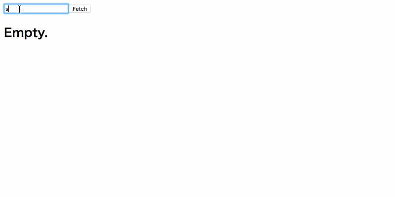

Redux 公式のページで紹介されている AJAX を使ったアプリをベースに、
GitHub の公開リポジトリを取得するアプリを作ってみました。

[React Redux Async Sample](/playground/react-redux-async-sample/)

動作イメージ ↓



## **環境**

- react 15.5.4
- redux 3.6.0
- react-redux 5.0.4
- redux-thunk 2.2.0

## **手順**

大まかなステップだけ説明します。

**1. State を決める**

最初にアプリケーション全体の State を決めます。
今回は以下のように単純な形でいきます。

```js
{
  username: "saitoxu",
  isFetching: false,
  repos: [
    { name: "repo1" },
    { name: "repo2" },
    { name: "repo3" }
  ]
}
```

**2. Action の定義**

Action はリクエストを送るときの`REQUEST_REPOS`と、
レスポンスを受け取ったときの`RECEIVE_REPOS`の 2 種類定義します。

GitHub の公開リポジトリを取得するのは Fetch API を使いました。

`gist:saitoxu/705e41267e50dee76d28eb98849edd90?file=actions.js`

**3. Reducer を作る**

次に、Reducer を作ります。
今回は State が単純なので、Reducer は 1 つだけで OK です。

`gist:saitoxu/705e41267e50dee76d28eb98849edd90?file=reducers.js`

**4. Store を作る**

Reducer から Store を作るのは簡単です。
非同期リクエストを扱うので、redux-thunk で提供されている`thunkMiddleware`をかませます。

`gist:saitoxu/705e41267e50dee76d28eb98849edd90?file=configureStore.js`

残りは[Gist](https://gist.github.com/saitoxu/705e41267e50dee76d28eb98849edd90)にあげているので確認してみてください。
