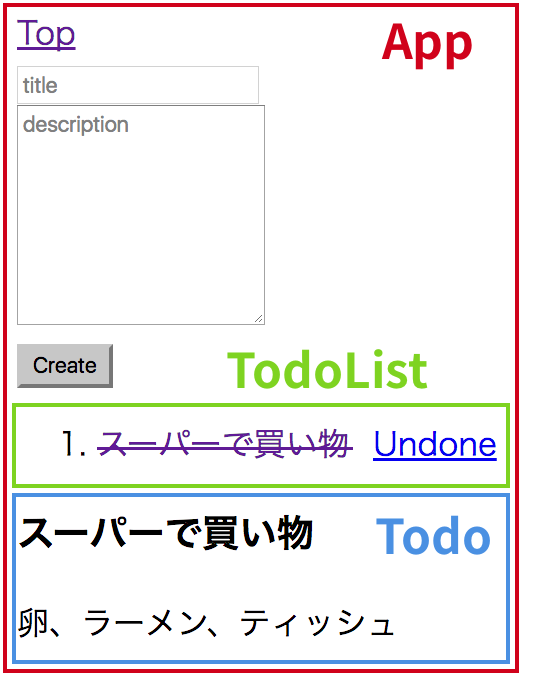

前回作った
[TODO アプリ](/playground/todo-app/)に、
[react-router](https://github.com/ReactTraining/react-router)
を使ってルーティングを組み込んでみます。

できたものはこちら ↓

[todo-app-2](/playground/todo-app-2/)

## **1. コンポーネントの構成**

コンポーネントの構成は次のような形にします。

また、ルーティングは次のとおりとします。

- `/` トップページ
- `/:id` 各 TODO の詳細ページ

各 TODO のリンクをクリックすると、その詳細が表示されるという簡単なものです。

## **2. 実装**

前回はちょっとややこしい作りにしてましたが、今回は`App`コンポーネントだけで state 管理をし、他のコンポーネントは基本レンダリングするだけにしました。

`gist:saitoxu/ea1f9838f288975bbbfe3722fe13d8ad?file=App.js`

※一応、残りの主要なコンポーネントも[Gist](https://gist.github.com/saitoxu/ea1f9838f288975bbbfe3722fe13d8ad)にあげてます。

## **3. おわりに**

TODO アプリに react-router を使ってルーティングを組み込んでみました。

次は Redux を触ってみる予定です。
