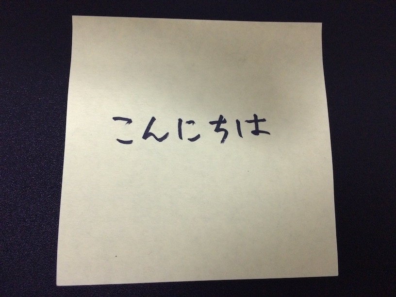

今更ながら Google Cloud Vision を試してみたので導入部分をメモしておきます。

#### **準備**

Google Cloud Platform のプロジェクトを作成します。

プロジェクト作成後、以下の手順が必要です。

- Google Cloud Vision API を有効にする
- API キーまたはサービスアカウントキーを発行する
- 課金を有効にする

#### **実装**

Node.js 用のクライアントライブラリがあるので、それを使います。

```sh
$ mkdir google-cloud-vision-test
$ cd google-cloud-vision-test
$ yarn init
$ yarn add @google-cloud/vision
```

今は`google-cloud`のライブラリ自体をインストールするより、
個別に使用するモジュールをインストールする方が良いみたいです。

Cloud Vision を使用するコードは次のようになります。
今回は OCR を使ってみました。

```js
// sample.js
const cloudVision = require("@google-cloud/vision")

const vision = cloudVision({
  projectId: "project-name",
  keyFilename: "/path/to/service-account-key.json",
})

vision.detectText("/path/to/image.jpg", (err, text, apiResponse) => {
  console.log(text)
})
```

#### **試してみる**

実際に使ってみます。

次のような画像を用意して文字認識をしてみます（字汚いですが）。



次のように結果が返ってきました。

```sh
$ node sample.js
[ 'こんにちは\n', 'こんにちは' ]
```

簡単ですが以上です。
