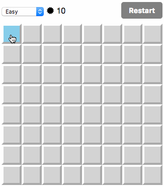

「[Reactでマインスイーパーを作ってみた](/2017/04/25/react-minesweeper.html)」で作ったマインスイーパーに、
[redux](https://github.com/reactjs/redux)を導入しました。
デモは[こちら](/playground/react-minesweeper/)。

盤面の状態をredux管理下に移すのはしんどかったので、
とりあえず難易度やクリア/ゲームオーバーの状態など、
ゲーム全体の情報だけをreduxで管理するようにしました。

だいぶ見通しがよくなって、機能追加がやりやすくなりました。
今後もコツコツ改善していこうかなと思います。

[react-minesweeper (GitHub)](https://github.com/saitoxu/react-minesweeper)
