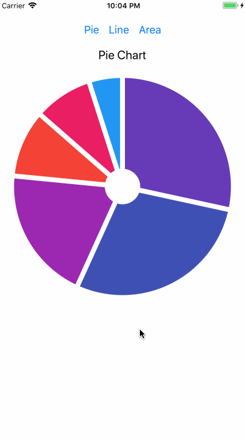

JavaScript には[D3.js](https://d3js.org/)というデータビジュアライゼーションのためのライブラリがありますが、
これを React Native で使ってみました。

D3.js は基本的に SVG(Scalable Vector Graphics)をいじってグラフを描画します。
React Native で SVG を扱うには、公式で提供されている[react-native-ART](https://github.com/facebook/react-native/tree/master/Libraries/ART)か、
react-native コミュニティで開発されている[react-native-svg](https://github.com/react-native-community/react-native-svg)
を使うと良いみたいです。

※余談ですが、公式の ART ライブラリはなぜかドキュメントがなく使い方を学ぶのに不便だったりします。

今回は D3.js と ART ライブラリを使ってグラフを描画しました。

最終的にできたのがこちらです ↓



## **準備**

ART と D3.js をインストールします。
iOS では Xcode を開いて、`node_modules/react-native/Libraries/ART/ART.xcodeproj`を Libraries に追加し、
`libART.a`を`Build Phases` -> `Link Binary With Libraries`で追加します。
D3.js は`yarn add d3`で OK です。

ここまでできたら使用するモジュールをインポートします。

```js
// ...

import { ART } from "react-native"
import * as d3scale from "d3-scale"
import * as d3shape from "d3-shape"
import * as d3Array from "d3-array"

const { Surface, Group, Shape } = ART

// ...
```

今回はパイチャートを例に D3.js と ART の使い方を見ていきたいと思います。

全体のコードは[こちら](https://gist.github.com/saitoxu/674fa7d75d729e37319715b5bcc00ff8)の gist に上げたので確認してみてください。

## **パイチャートの描き方**

パイチャートを描くには、`Surface`コンポーネントの上に扇形の`Shape`コンポーネントを描いていくイメージになります。
まず、次のようなデータを用意します。

```js
const pieData = [
  { number: 8, name: "Fun activities" },
  { number: 7, name: "Dog" },
  { number: 16, name: "Food" },
  { number: 23, name: "Car" },
  { number: 23, name: "Rent" },
  { number: 4, name: "Misc" },
]
```

次に、各データを表す扇のパスを取得します。

```js
const arcs = d3shape.pie().value(item => item.number)(pieData)
const pieChart = { paths: [] }
arcs.map((arc, index) => {
  const path = d3shape
    .arc()
    .outerRadius(180)
    .padAngle(0.05)
    .innerRadius(30)(arc)
  pieChart.paths.push({ path })
})
```

あとは、取得したパスを`Shape`コンポーネントに渡せば完成です！

```jsx
return (
  <Surface width={width} height={width}>
    <Group x={width / 2} y={width / 2}>
      {pieChart.paths.map((item, index) => (
        <Shape
          key={`pie_shape_${index}`}
          fill={colors[index]}
          stroke={colors[index]}
          d={item.path}
        />
      ))}
    </Group>
  </Surface>
)
```

折れ線グラフやエリアチャートも基本的にはいっしょで、
D3.js の API を使ってパスを取得し、ART のコンポーネントに渡すだけです。

## **おわりに**

以上、D3.js を使って React Native でグラフを描いてみました。

自分は D3.js や SVG に詳しくなかったので最初苦労したんですが、
慣れていれば React Native でも簡単にグラフを描けると思います。

今回はやりませんでしたが、アニメーションなどもいけるみたいなので興味ある方はやってみてください！

#### **参考文献**

- [Animated Charts in React Native using D3 and ART – The React Native Log – Medium](https://medium.com/the-react-native-log/animated-charts-in-react-native-using-d3-and-art-21cd9ccf6c58)
- [React Native ART and D3](http://hswolff.com/blog/react-native-art-and-d3/)
