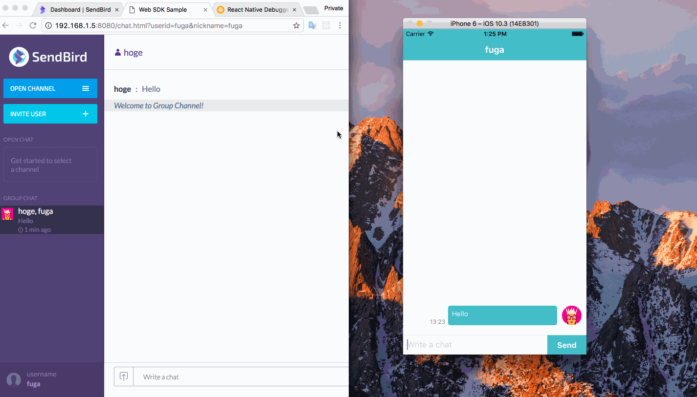

[SendBird](https://sendbird.com/)という簡単にチャット機能を作れる SDK と API を提供しているサービスがあります。
今回これを使ったサンプルアプリを React Native で書いてみました。

次のように動きます。



リポジトリはこちらになります。

[saitoxu/SendBirdSample](https://github.com/saitoxu/SendBirdSample)

## **SendBird SDK (JavaScript)の使い方**

(1) はじめにユーザを作成して SendBird に接続します。

```js
sb.connect(myUserId, (user, error) => {
  // do something
})
```

(2) 次にチャンネルを作ります。`userIds`に渡したユーザとのグループチャンネルが作れます。
ユーザ ID を 1 つ渡せばそのユーザとの 1 対 1 のチャットができます。
2 つ目の引数の`distinct`は`true`だと以前のチャンネルを引き継ぎ、`false`だと毎回新しくチャンネルを作ります。
以前のメッセージを引き継ぎたい場合は`true`にする必要があります。

```js
const userIds = [friendUserId]
const name = "sample group channel"
sb.GroupChannel.createChannelWithUserIds(
  userIds,
  true /* distinct */,
  name,
  null,
  "",
  (channel, error) => {
    // do something
  }
)
```

(3) メッセージは次のように送信します。

```js
channel.sendUserMessage("message body", "", (message, error) => {
  // do something
})
```

(4) メッセージの受信はハンドラオブジェクトを作成して、
コールバックを登録すると受信できます。

```js
const ChannelHandler = new sb.ChannelHandler()
ChannelHandler.onMessageReceived = (receivedChannel, message) => {
  // do something
}
sb.addChannelHandler("ChatView", ChannelHandler)
```

## **使ってみて**

- バックエンドの実装が不要で、上記のとおりかなり簡単にチャットシステムが作れます
- 既読機能や入力中かどうか取得する機能、ファイル添付など、チャットに必要な機能がほとんど揃っています
- フリープランで 1,000MAU、同時コネクション 25 まで使えるので、プロトタイプなどに使えそうです。現在のところ有料プランの価格は問い合わせる必要があります

調べたところあまりまだ知名度が高くないようですが、とてもいいサービスだと思いました。
チャット機能を作ろうと考えている方はぜひ検討してみてください！
