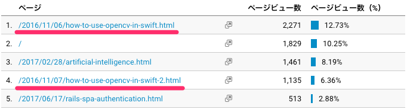

ブログを続けて 1 年が経ちました（パチパチ）。

Google Analytics を初期の方から仕込んでいたので、今回はそれを見ながら徒然なるままに振り返りたいと思います。

## **ページビューは 18,000 弱/年**

少ない...ですが笑、グラフを見ると後半多くなってきている感じはします。下のグラフが年間のページビューの推移です。

基本的にこのブログは自分のアウトプットの場として、業務で調べたことなどを書いています。
そこで、セッション別の流入元を見てみると（以下のグラフ）、オレンジ色の Organic Search、いわゆる検索流入が増えているのが分かります。

やっぱりこういう技術系のブログは記事をストックしていくと、
ググるときにヒットして、そこからの流入が増えていくみたいです。

試しに Google Search Console で検索キーワードを調べると、
やはり技術系のキーワードが多いですね。

「preact」のクリック数が一番多いのはちょっと意外でしたが、まぁ他にあんま書く人がいないですからかね笑

ちなみに「preact」の記事はこれです ↓

[preact を使ってブログのアーカイブメニューを作る \| yosuke.saito](https://saitoxu.io/2017/07/01/jekyll-archive-preact.html)

## **英語の記事の方が多く読まれる？**

昨年末くらいまでは英語の勉強をかねて、英語で記事を書いてました。
結局、会社起こして忙しくなったりしたので止めたんですが笑

でもページ毎の累計ビュー数を見ると、だいぶ昔に書いた英語の記事が一番多くて意外でした（下線を引いてるのが英語の記事）。

これだけだと何ともですが、やっぱりターゲットユーザが多いほうが（ページビュー稼ぐには）良さそうだなあと思った次第です。

## **おわりに**

月 3,4 記事くらいですが、やっぱり定期的にアウトプットする機会があると自分のためになるなあと思っています。
こうして振り返るときも面白いですし。
今の職掌的にはエンジニアリングだけでなくもっと視野を広げていかないといけない立場でもあるので、
2 年目からは技術ネタ以外にも書いていけたらなーと思っています。
