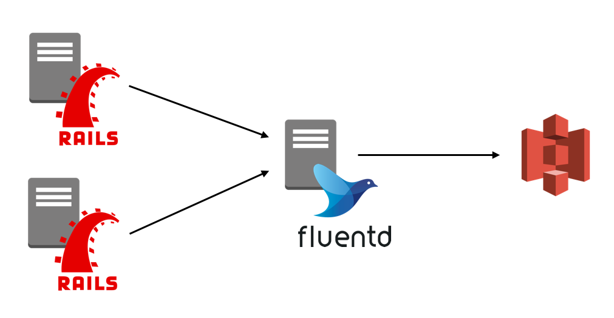

RailsのログをFluentdでS3に保存する方法を調べました。
次のようにログの集約サーバを配置する構成で考えます。



集約サーバはCentOS7系で進めます。

## **IAMユーザの用意**

S3にログを保存するために、
保存先のバケットへのアクセス権限を持つIAMユーザを作成します。
作成したらアクセスキーIDとシークレットキーを控えておきます。

## **集約サーバの準備**

まずログの集約サーバの準備をします。

#### td-agentのインストール

はじめにtd-agentをインストールします。

```sh
$ curl -L https://toolbelt.treasuredata.com/sh/install-redhat-td-agent2.sh | sh
```

#### プラグインのインストール

次にプラグインをインストールします。
プラグインのインストールは`td-agent-gem`を使います。

```sh
$ sudo td-agent-gem install fluent-plugin-forest
```

[fluent-plugin-forest](https://github.com/tagomoris/fluent-plugin-forest)は
`<template>`や`<case>`ディレクティブでマッチしたタグ名を使えるプラグインです。
タグ名毎に出力するファイルを分けたいときなどに、設定が冗長にならずに済みます。
ちなみにFluentdの最新バージョンであるv0.14ではプラグインなしでできるそうです。

#### 環境変数の設定

IAMユーザのアクセスキーなどは環境変数として設定して、
それをtd-agentの設定ファイルから読むことにします。
環境変数はこちらの方法を使って設定します。

[td-agent.conf 設定パラメータの値を環境変数から参照したい - ようへいの日々精進XP](http://inokara.hateblo.jp/entry/2016/09/17/091659)

`/etc/sysconfig/td-agent`は設定後、次のようになると思います。

```sh
export S3_BUCKET=test.bucket # ログを保存するS3のバケット
export AWS_KEY_ID=ABCDEFGHIJKLMNOPQRST # 上記バケットへのアクセスを持つIAMユーザのキー
export AWS_SEC_KEY=abcdefghijklmnopqrstuvwxyz1234567890ABCD # 上記IAMユーザのシークレットトークン
```

#### 設定ファイルの作成

設定ファイルはたとえば次のようになります。

```sh
<source>
  @type forward
  port 24224
  bind 0.0.0.0
</source>

<match *.**>
  @type forest
  subtype s3
  <template>
    aws_key_id "#{ENV['AWS_KEY_ID']}"
    aws_sec_key "#{ENV['AWS_SEC_KEY']}"
    s3_bucket "#{ENV['S3_BUCKET']}"
    s3_region ap-northeast-1

    path
    buffer_path /var/log/td-agent/buffer/${tag}
    time_slice_format %Y/%m/%d/${tag}/ec2-%Y-%m-%d-%H
    retry_wait 30s
    retry_limit 5
    flush_interval 1h
    flush_at_shutdown true
  </template>
</match>
```

これにて集約サーバの設定は完了です。

## **Railsの設定**

次にRailsの設定をしていきます。

#### gemのインストール

```ruby
# Gemfile
gem 'act-fluent-logger-rails'
```

[act-fluent-logger-rails](https://github.com/actindi/act-fluent-logger-rails)は
ログをFluentdに流すためのgemです。
カスタマイズ性は低いですが、
取り急ぎFluentdにログを流したいときにサッと使えるので今回はこれを使っていきます。

#### 設定ファイルの更新

`application.rb`や`production.rb`などの環境毎の設定ファイルを更新します。

```ruby
# config/environments/production.rb
Rails.application.configure do
  # ...

  config.logger = ActFluentLoggerRails::Logger.new(
      log_tags: {
        ip: :ip,
        ua: :user_agent
      }
    )
  config.lograge.enabled = true
  config.lograge.formatter = Lograge::Formatters::Json.new

  # ...
end
```

#### `config/fluent-logger.yml`の追加

集約サーバの設定を追加します。

```yml
production:
  fluent_host:   <%= ENV['FLUENT_HOST'] %>
  fluent_port:   24224
  tag:           'sample.tag'
  messages_type: 'string'
```

以上でRailsの設定も完了です。
これで集約サーバを介してS3にログが保存されるようになります。
