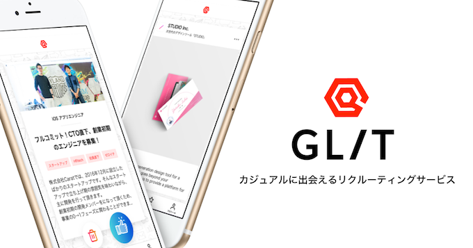
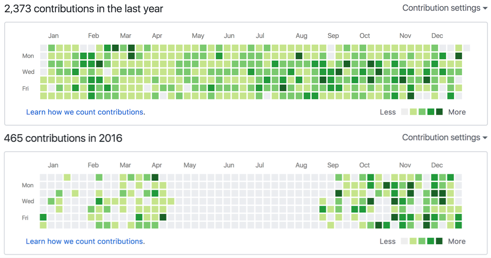

会社を創業して 1 年が経ち、一応 CTO として 1 年間携わってきたので雑に今年 1 年を振り返ってみたい。
あまり創業期の話を CTO 目線で語る記事がないなと思ったので、これから CTO としてスタートアップをやろうという人の参考になればと。

## **色々作った**

若干去年末に話が被るが、創業してからは今やってるサービスも含め 3 つのサービスを作った。
はじめは AI Travel のような、自動で出張プランを作成する Web サービスを作ったが色々あってうまく行かずストップ。

2017 年年始からはカメラマン版の Uber のようなサービスを作ったが CtoC で稼ぐことの難しさを感じ 3 ヶ月くらいでこれもあえなく撤退。

そして 4 月から、Tinder UI が特徴の[AI 求職アプリ GLIT（グリット）](https://glit.io)を開発し今に至る。

色々作って・事業を変えてみて思うのは、マーケットのポテンシャルがすごく大事だなということ。
スタートアップの成否には色々な原因があるが、最大の分水嶺となるのは市場があるのかないのかということかと肌身で感じた 1 年だった。

この辺の話は代表が書いた記事にも書いてあるので、詳しく知りたい方はどうぞ。

[２度の事業ピボット・創業者の離脱・キャッシュアウト寸前？だったスタートアップの創業１年を振り返ってみた \| 株式会社 Carat](https://www.wantedly.com/companies/caratinc/post_articles/101445)

## **色々な技術に触れられた**

今年 1 年は本当に色々な技術を使うことができた。
ざっと思い当たるだけでも以下のようなツール・技術を新しく使ってきた。

- React
- React Native
- Ruby on Rails
- 機械学習(Python)
- インフラ(AWS, Docker, Terraform, ...)

起業する前は Java と JavaScript(jQuery や、マイナーだが ExtJS など)を使って業務用 Web アプリケーションを作っていたが、開発スピード(主に Rails の話)と採用のしやすさ、あとは自分が使ってみたいという思いもあって慣れた技術は使わずに新しい技術にチャレンジすることにした。

React Native もちょっと使ってみようくらいの気持ちで使ってみたが、ちょうど国内でも色々な採用事例が出てきた 1 年でもあり、Web 側の React とほとんど同じように組み立てれるというメリットもあってこれは採用して良かったなーと思っている。

機械学習やインフラもできるようになりたいと思っていたので、本業の人には遠く及ばないものの今年まず一歩を踏み出せたのは良かった。

## **メンバーが増えた**

今年のはじめはエンジニアは自分一人だったが、今はエンジニア 4 名、デザイナー 1 名の計 5 名にまでチームが大きくなった。

一人で開発するのはそれはそれで楽な面もあったが、やはり人数がいたほうが開発スピードも上がるし、他人の意見も入れることでプロダクトにもいい影響があるなーと感じた。
ただ、現状全員リモートで勤務してもらっているので、その辺の難しさはちょっと感じた。

あと自分は仕事でデザイナーといっしょにサービス開発というのをしたことがなく、そういう意味でも学びの多い一年だった。

## **草生やした**

前職は社内の VCS でコードを管理していたが、起業してからは GitHub でコードを管理するようにし、だいぶ草を生やした。
上が今年の contributions で、下が去年のもの。

コツコツやるタイプの自分としては、こうやって仕事の成果が可視化されていると 1 年頑張ったなあというのが分かって嬉しい。

## **2018 年の抱負**

2017 年はひたすらコードを書き、チーム作りに奔走した 1 年だったが、チームも少しずつ形になってきたので 2018 年はアウトプットにも力を注ぎたい。
具体的には OSS への contribution や外での発表などになると思うが、スタートアップながらうちは技術に力を入れてますよというのを対外的にアピールしていけたらいいなあと。

というわけで 2018 年もよろしくお願いします。
