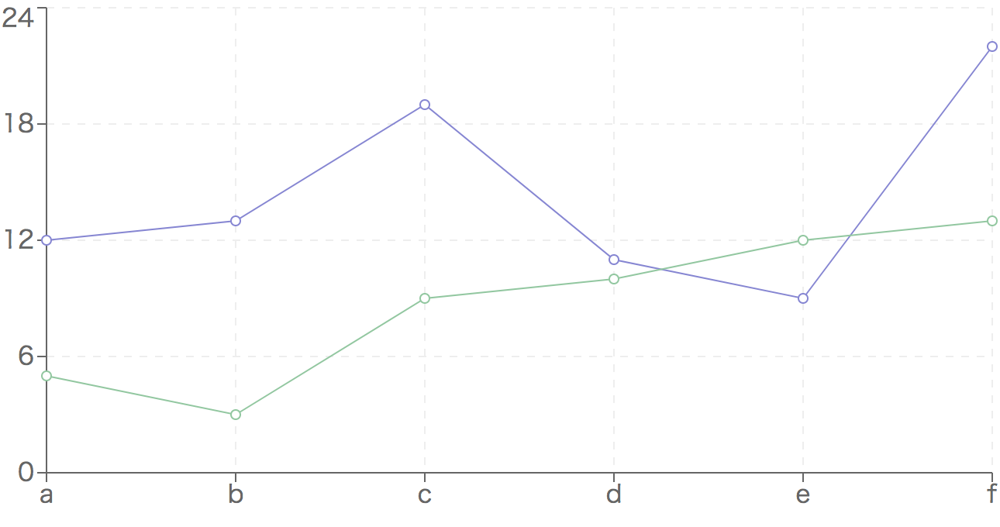

前から気になっていた React のグラフ描画ライブラリ[Recharts](https://github.com/recharts/recharts)を触ってみた。
内部で[D3.js](https://github.com/d3/d3)を使っていて、README に書いてあるが大きな特徴は 3 つあるらしい。

- React コンポーネントとして使える
- 素の SVG の描画をサポート
- 画面に表示したいコンポーネントを宣言するだけで描画可能

基本は次のように使う。

```js
import React, { Component } from "react"
import { LineChart, Line, XAxis, YAxis } from "recharts"

class App extends Component {
  render() {
    const data = [
      { name: "a", uv: 12, pv: 5 },
      { name: "b", uv: 13, pv: 3 },
      { name: "c", uv: 19, pv: 9 },
      { name: "d", uv: 11, pv: 10 },
      { name: "e", uv: 9, pv: 12 },
      { name: "f", uv: 22, pv: 13 },
    ]
    return (
      <div className="App">
        <LineChart width={400} height={200} data={data}>
          <XAxis dataKey="name" />
          <YAxis />
          <Line dataKey="uv" stroke="#8884d8" />
          <Line dataKey="pv" stroke="#82ca9d" />
        </LineChart>
      </div>
    )
  }
}

export default App
```


各チャートコンポーネント（`<LineChart />`など）のドキュメントに、
子コンポーネントとして受け取れるパーツのコンポーネント（`<XAxis />`, `<Line />`など）が定義されているので、
その中から描画したいコンポーネントを追加していく。

たとえば上記の例に`<CartesianGrid />`という格子上の線を描くコンポーネントを足すと以下のようになる。

```js
class App extends Component {
  render() {
    // ...

    return (
      <div className="App">
        <LineChart width={400} height={200} data={data}>
          <CartesianGrid stroke="#eee" strokeDasharray="5 5" />
          <XAxis dataKey="name" />
          <YAxis />
          <Line dataKey="uv" stroke="#8884d8" />
          <Line dataKey="pv" stroke="#82ca9d" />
        </LineChart>
      </div>
    )
  }
}
```



また、チャートコンポーネントを`<ResponsiveContainer />`というコンポーネントで囲うと画面サイズに応じてグラフのサイズを可変にできる。

```js
class App extends Component {
  render() {
    // ...

    return (
      <div className="App">
        <ResponsiveContainer
          width="80%"
          height="40%"
          minWidth={400}
          minHeight={200}
        >
          <LineChart data={data}>
            <CartesianGrid stroke="#eee" strokeDasharray="5 5" />
            <XAxis dataKey="name" />
            <YAxis />
            <Line dataKey="uv" stroke="#8884d8" />
            <Line dataKey="pv" stroke="#82ca9d" />
          </LineChart>
        </ResponsiveContainer>
      </div>
    )
  }
}
```

公式では対応していないが、以下の記事によると React Native でも使えるらしい。

[Using Recharts in React Native project - DZone Web Dev](https://dzone.com/articles/using-recharts-in-react-native-project)

以上、徒然なるままに紹介したが、けっこう使いやすく、そこそこにカスタマイズもできそうなので今後実プロダクトで使ってみたい。
