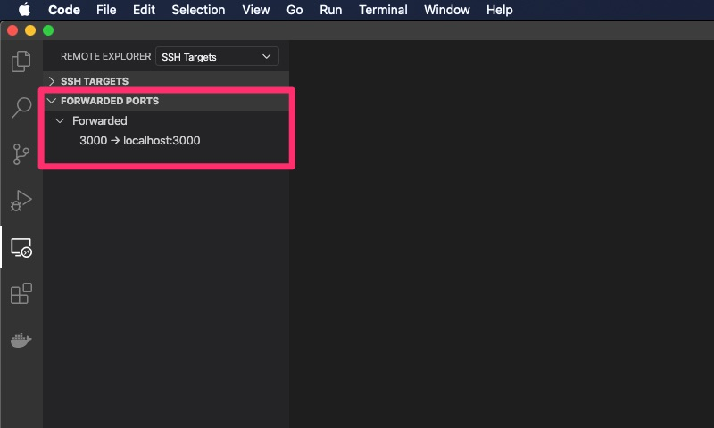

長らくDocker for Macを使って開発していましたが、
[VSCodeのRemote SSH機能](https://code.visualstudio.com/docs/remote/ssh)を使って
リモートのLinux環境に開発環境を移行しました。
結果、めちゃくちゃ開発体験良くなったので、移行方法とともに紹介したいと思います。
なお、VSCodeのRemote SSH機能の使い方自体はいくつも記事があるため割愛します。

## 移行前の課題

普段はREST API(Ruby on Rails)やWebフロント(React)・アプリ(Reeact Native)の開発をしており、
RailsのDockerコンテナを常に立ち上げて開発しています。
Web開発だとよくある構成かと思いますが、以下の点が課題と感じていました。

### Docker for Macが遅い

よく言われていることですが、Docker for Macが遅いです。
そこそこ依存コンテナ数があるため、Railsのdevサーバを立ち上げたり、単体テストを流すのに数十秒〜待つこともしばしばあります。

### 使用されていないコンテナやイメージの削除が面倒

ローカルのSSD容量が逼迫しているため、しばしばディスク容量不足でDockerコンテナのビルドに失敗したりDBの書き込みに失敗したりしてました。
そのたびに不要なコンテナやイメージを削除したり、ファイル等削除するのが手間でした。

---

年始に「[DXを大幅に低下させるDocker for Macを捨ててMac最速のDocker環境を手に入れる - Qiita](https://qiita.com/yuki_ycino/items/cb21cf91a39ddd61f484)」の記事を読んだりして
VirtualBoxに移したいが容量ないしなーとか思ってたのですが、Remote SSH使ってリモートサーバで開発すれば

* (料金との兼ね合いはあるものの)メモリ・容量実質無制限
* バックアップ簡単に取れる
* PC買い替えてもVSCode入れれば終わりなので移行が楽

と思い立ち移行してみました。

## やったこと

社内のRuby on RailsのプロジェクトをEC2の[Amazon Linux 2](https://aws.amazon.com/jp/amazon-linux-2/)に移行してみました。
VSCode Remote - SSHの設定等は「[VSCode の Remote – SSH 機能を使って EC2 上で開発する – サーバーワークスエンジニアブログ](http://blog.serverworks.co.jp/tech/2020/02/20/vscode-remote-ssh/)」の記事などを参考にしていただき、その他やったことを書きます。

### git, dockerのインストール

`yum`コマンドで入れます。

```sh
$ sudo yum update
$ sudo yum install -y git
$ sudo yum install -y docker
```

### dockerのインストール後処理

ユーザー権限周りの設定を行います。
このあたりはDocker for Macは不要だったので新鮮でした。

[Post-installation steps for Linux | Docker Documentation](https://docs.docker.com/engine/install/linux-postinstall/)

```sh
$ sudo groupadd docker
$ sudo usermod -aG docker $USER
$ newgrp docker 
$ sudo systemctl enable docker
$ sudo systemctl start docker.service
$ docker run hello-world
```

### docker-composeインストール

[Install Docker Compose | Docker Documentation](https://docs.docker.com/compose/install/)

```sh
$ sudo curl -L "https://github.com/docker/compose/releases/download/1.25.5/docker-compose-$(uname -s)-$(uname -m)" -o /usr/local/bin/docker-compose
$ sudo chmod +x /usr/local/bin/docker-compose
$ docker-compose --version
```

あとはプロジェクトの初期設定を行って`docker-compose up -d`などとすれば終わりです。
Dockerのportabilityすごい。

左側のペインでRemote Explorerを開いているときに「Forwaded Port」というセクションがあって、
ここでローカルのポートxへの通信をリモートサーバのポートyに転送するという設定ができます。
フロントエンドやアプリの開発をローカルで行っていて、開発中APIサーバが必要というケースもこれで対応できます。



あとリモートサーバに`code`コマンドが追加されるため、
プロジェクト外のファイルも`code hoge.txt`などと実行することでローカルのVSCodeで簡単に編集できます。
これが地味に便利だなと思いました。

試験的にかなり小さめのサイズのインスタンス(t2.micro, メモリ1GiB)を立ち上げてやってみたのですが、
Docker for Macより全然キビキビ動く印象です。
仮にm5.large(メモリ8GiB)のオンデマンドインスタンスを使うとしても、
0.124USD/hで160h/month使うと月々2000円くらいなので、
けっこう経済的だなーと思います。

## おわりに

思いの外すんなり移行できて、今のところ全然デメリットを感じないのでVSCode Remote - SSHすごいなと思いました。
これでしばらく開発してみたいと思います。

とは言え[新しい13インチ Macbook Pro](https://www.apple.com/jp/macbook-pro-13/)はほしい。
