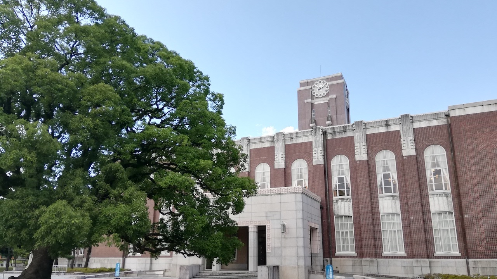

 

タイトルのとおりですが、今月にあった京都大学大学院 情報学研究科 博士後期課程 (社会情報学専攻)(長い..)の入試に無事合格しました。

2021年4月から社会人ドクターとして入学予定です。修士課程修了から数えると7年ぶりにアカデミックの世界に戻ることになります。

博士課程受験にあたり、インターネット上に参考になる情報が少なく苦労したので、
これから博士課程受験を考えている方の参考になるように受験時の記録を残したいと思います。

## 受験を決めるまで

ここ2,3年ですが仕事で推薦システムの開発を担当しており、
情報推薦や情報検索の分野で専門性を深めたいと思っていました。

専門性を身につけるのに別に博士課程に進む必要性はないのですが、
博士の学位を取れれば海外でも胸を張って専門家と言えますし、
会社で業務を通じて勉強するより、研究として取り組んだ方が深く学べるだろうと思い進学できたらなーくらいに思ってました。

### 社会人博士進学者の話を聞く(2月)

自分が受験した社会情報学専攻は、毎年冬に社会人博士OB・OGの方からの体験談を聞ける機会を設けており、
自分も今年聞きに行ってみました。

話を伺ったところ、東京都内で働きながらリモートで研究を進めていたという方がいらっしゃったり、
専攻として社会人博士の受け入れに関してウェルカムな雰囲気を感じられたので、
研究テーマさえなんとかなれば受験はできそう(合格するかどうかはさておき)と思うに至りました。

ちなみに、この時点で今年の受験は考えていませんでした。

### 専攻の入試説明会に参加(5月)

COVID-19の影響で入試説明会がオンラインで開催されるということだったので、
このときも聞くだけ聞いてみようということで参加しました。
例年通り現地開催だったら行ってなかったかもしれません。

説明会では推薦システムを専門に研究されている先生とお話することができ、
ぼんやりですがなんとなく考えていた研究ドメインについてお話させていただき、
領域としては悪くなさそうという感触を得ました。

### 本当に受験するか考える

入試説明会が5月末にあり、入試は8月1日の予定でしたので準備期間はちょうど2ヶ月でした。

この2ヶ月で研究計画書を作成し、筆記試験・口頭試問の対策をするには準備期間として短すぎると思い、
来年以降の受験でも良いかなと思いました。

しかし、たとえ合格しなくても準備する過程が自分のためになると考え、
あとは家族の後押しもあり受験にトライすることにしました。

## 受験準備

### 研究テーマ決め

受験するとなればまず研究計画書を作成する必要があります。
出願書類の提出締め切りが6月下旬でしたので、それまでの間は研究計画書の作成に専念しました。

自分の場合、修士や社会人時代での積み上げのない状態での研究テーマ決めだったので、
この研究計画書の作成が一番大変でした。

仕事終わりや休日に関連研究の論文を読み、
自身の推薦システムの開発・運用経験から得た知見を織り交ぜつつ、
何とか形にしていきました。
志望する研究室の先生にも多大なるアドバイスをいただき、無事研究計画書を提出することができました。

### 試験対策

出願書類提出後は筆記試験対策に励みました。
主に専門科目の勉強に時間を割き、自分で何冊か大学で使うような教科書を買って勉強しました。

これも研究テーマ決めと同じく、知識の積み上げのない状態からのスタートだったのでなかなか苦労しました。
案の定、当日の専門科目の出来は悪かったです(苦笑)

## おわりに

というわけで、(専門の出来が悪すぎて不合格かと思いましたが)無事試験に合格することができました。
現在は入学後に良いスタートダッシュを切れるよう、専門知識のインプットに努めています。

冒頭にも書きましたが、博士課程の入試にあたって参考となる情報を探すのに苦労したので、
今後博士課程受験を考えている方にこの受験記が多少なりとも役に立てば幸いです。
なにか質問等ありましたらTwitterでDMいただければ相談くらいには乗れると思います。
