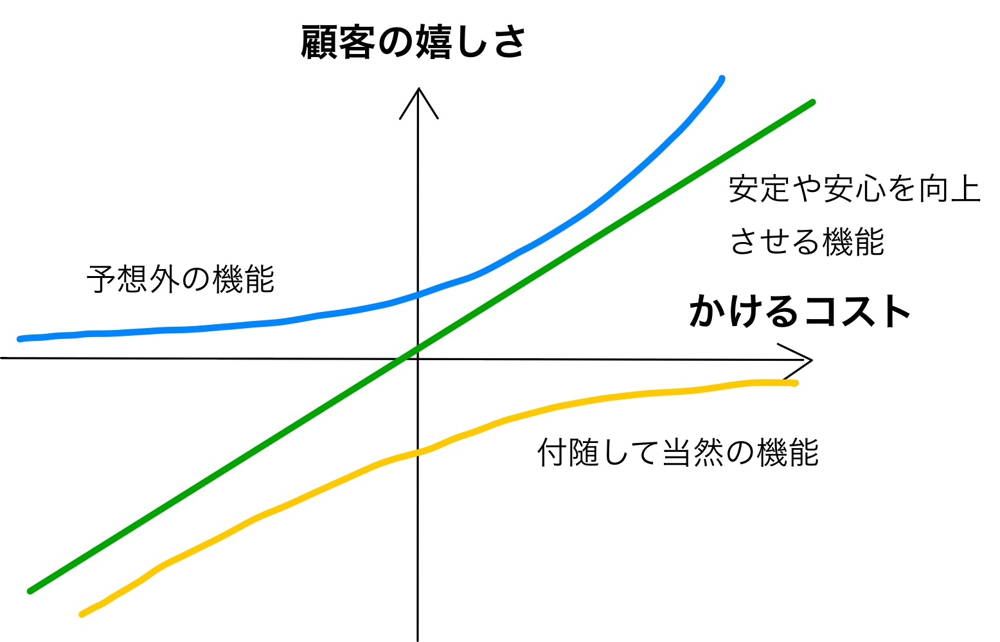

10/27(火)に行われた[プロダクトマネージャーカンファレンス2020](https://2020.pmconf.jp/)に参加してきました。
毎年参加したいと思い続けてなかなか予定が合わなかったのですが、今年はZoomでの開催というのもあり初めて参加できました。
とても学びの多いセッションばかりだったので、備忘録がてら学んだ内容を残します。

最初のキーノートを含めると計9セッション聞いてきました。

## 宮坂副都知事が考える行政におけるプロダクト開発とは？ - 宮坂学副都知事

Tably株式会社の及川さんがインタビューをする形で、宮坂副都知事が現在進めている行政のDXに関してのお話を聞かせていただきました。
民間でのビジネスとの対比が面白かったです。

* ビジネスの世界だとマーケットの2,3割取れれば上出来というところが、行政の世界では100%カバーしなければならない
* 一言に都民と言っても、法人や観光・ビジネスで訪れる人、これから生まれてくる人などを含めて広く考えなければならない

このあたり、ビジネスの世界では意識することがなかったのでハッとしました。

あとは「ホームページを運用するということは大事なことが詰まってるなと改めて思った」と仰っており、Yahoo!の代表まで上り詰めた人でもこんな風に考えるだなーと思いました。
自分も改めて基本を大事にしていこうと思いました。

## Jobs to be Done for Product Management - Jim Kalbach(MURAL)

「ジョブ理論」(クレイトン・M・クレイストン著)という本が数年前にブレイクしてましたが、Jobs to be Done(JTBD)はそのジョブ理論をプロダクトマネジメントで実践するためのフレームワークになります。

JTBDは様々なテクニックを含むということで発表では一部の紹介のみでしたが、顧客のジョブを特定するための便利な考え方・言語を提供してくれているという印象で、使いこなせたらプロダクト開発の強力な武器になりそうです。

洋書ですが勉強できる本もあります。
[The Jobs To Be Done Playbook: Align Your Markets, Organization, and Strategy Around Customer Needs](https://www.amazon.co.jp/dp/B07X1LQ45Y)

## 製造業PFの立ち上げ期にPMが向き合った課題と突破口の話 - 笹口 直哉(キャディ株式会社)

プロトタイプのままずっと稼働していたプロダクトをリプレイスした話でした。
激しく成長する組織の中で停止なく置き換える必要があるという難しい問題に、真っ向からトライしているのが印象的でした。

発表の内容とは少し逸れますが、CADDiが解決しようとしているペインの大きさがすごいなと思いました。そりゃあれだけ大型調達できるわ。

スライドは[こちら](https://speakerdeck.com/sasaguchi/pmconf2020-zhi-zao-ye-pffalseli-tishang-geqi-nipmgaxiang-kihe-tutake-ti-totu-po-kou-falsehua)

## mmhmmが生まれるまでと今後の展望から学ぶプロダクトの作り方 - Phil Libin(All Turtles and mmhmm)

[mmhmm](https://www.mmhmm.app/)やEvernoteの創業者として著名なフィル・リービン氏の発表です。
めちゃくちゃ気づきの多い内容でした。

* すべてがハイブリッドに進化した現代(in person <-> online, live <-> recorded)
* 新規のプロダクト開発なら永続的な変化の観点から考える、既存のプロダクトを改善したいなら一時的な変化に注目する
* 顧客にyesと言わせるのとnoと言わせないことに注力する → yesという人がyesと発信し、noという人が無言なら成功できる
* 努力と顧客の嬉しさのマッピング(下図)。Yesカーブにまず努力を注ごう。それから直線、Noカーブはあまり時間使わなくてよい
* 顧客は嫌いなことを伝える能力が高い、顧客が伝える解決策はほぼ間違い。医者と患者のメタファー

かけるコストと顧客の嬉しさの関係(発表にあったスライドから作成)

## 500人で1つのアプリを作っている話 - 木下 慶(株式会社メルカリ)

タイトルの通り500人という大きな組織でどうやって1プロダクトの開発を行っているのかという話で、1プロダクトに500人もいたら逆に不都合な気がしてたのですが発表を聞いてなるほどなーと納得しました。

個々人の優秀さだけでなく、組織作りのうまさもメルカリを今のポジションまで押し上げた要因の1つなんだなと思いました。

スライドは[こちら](https://speakerdeck.com/kkino0927/500ren-te1tufalseahuriwozuo-tuteiruhua-pmconf2020fa-biao-zi-liao-34f8d566-10d7-4a0c-8db0-ae691b448907)

## プロダクトマーケティングマネージャー（PMM）との協働によるPM業務の分業と専門化 - 重松 裕三(株式会社SmartHR)

プロダクトマーケティングマネージャー(PMM)とはなんぞやという話から、PMMを配置するメリット・デメリット、PMMを置くべき組織や置いたほうがよいタイミングなど濃い内容でした。

PM業務は業務量が多すぎるので分業が進んでいくというのはまさにそうだなーと思いました。

スライドは[こちら](https://speakerdeck.com/yuzoshigematsu/what-is-product-marketing)

## 顧客起点のグロースフレームワーク - 西口 一希(株式会社 Strategy Partners)

* 顧客全体が見えない経営だと、成長への投資を早く諦めてしまったり、ブランドが短命になったり等する
* 顧客にとってあくまで自社は選択肢の1つでしかないので、自社起点で顧客を見るのは決定的に視点が狭い
* 顧客起点で考えることで、グロースポイントが見つかる

という内容でした。
自分もユーザーファーストと言いつつ、自社起点で考えてたなーなどと反省・気づきの多い内容でした。

本があるそうなので是非読んでみたいです。
[たった一人の分析から事業は成長する 実践 顧客起点マーケティング](https://www.amazon.co.jp/dp/4798160075)

## AnycaとChompyで学んだ「感情」の扱い方 - 大見 周平(株式会社シン / SYN, Inc.)

プロダクトに「感情」を盛り込む意義とその方法論についての発表でした。

* プロダクトも会社もゴールは幸せの最大化
  * 幸せは経済合理と感情の両方が満たされた状態
  * 過度に経済合理に偏ると長期でプロダクトを破壊する
* プロダクトに感情を取り入れる方法論
  * 合理と感情の双方に効く仕組みを作ろう
  * 良いアイデアは複数の課題をまとめて解決する

切り口がまず面白いと思ったし、内容もめちゃくちゃ参考になりました。

スライドは[こちら](https://speakerdeck.com/shuheeeeei/anycatochompydexue-nda-gan-qing-falsexi-ifang-number-pmconf2020)

## 新市場をこじ開ける、リクルートの価値検証のリアル ~Airレジ ハンディ セルフオーダーのブレない「価値」の確かめ方 - 川崎 絢司(株式会社リクルート)

Airレジ ハンディ セルフオーダーを題材に、実際の価値検証についてのかなり踏み込んだ内容の発表でした。
価値検証のプロセスが体系的にまとめられており、特にキーアイデアの「価値と対価は因果ループを持つ」というのは確かにと思いました。

MVPをどこまで作るかという話では、価値・対価ループへの影響度を考慮して以下の3つに品質レベルを分け優先度を決めたそうで、参考になります。

1. **価値・対価の阻害解消**: 価値と対価のループが止まってしまうので、これをまず最初に解決する
1. **効率化**: 価値と対価のループを速める
1. **付加価値**: 価値と対価のループには直接的に関係はしない、優先度低

## おわりに

たいへん学びの多いカンファレンスでした。
PMでなくても、プロダクト開発に携わる人は一度参加してみると、チーム内で色々議論できて気づきが得られるのではと思います。
今回聞いた中ではフィル・リービン氏のが個人的なベストですかね、プロダクト開発のエッセンスを簡単な言葉に落とし込んでるのは凄いなと思いました。
来年もあれば是非参加したいです。
