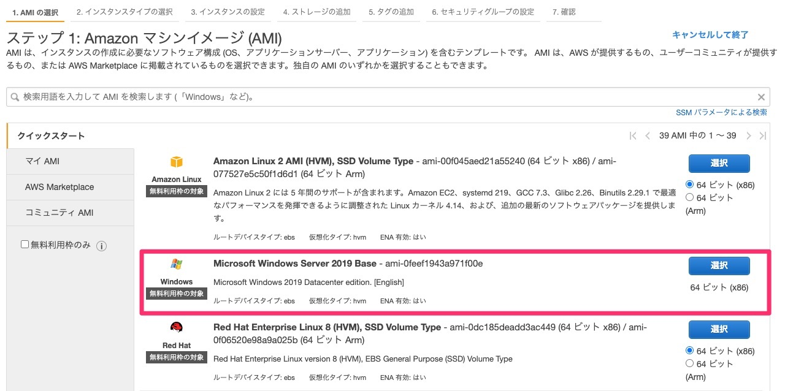
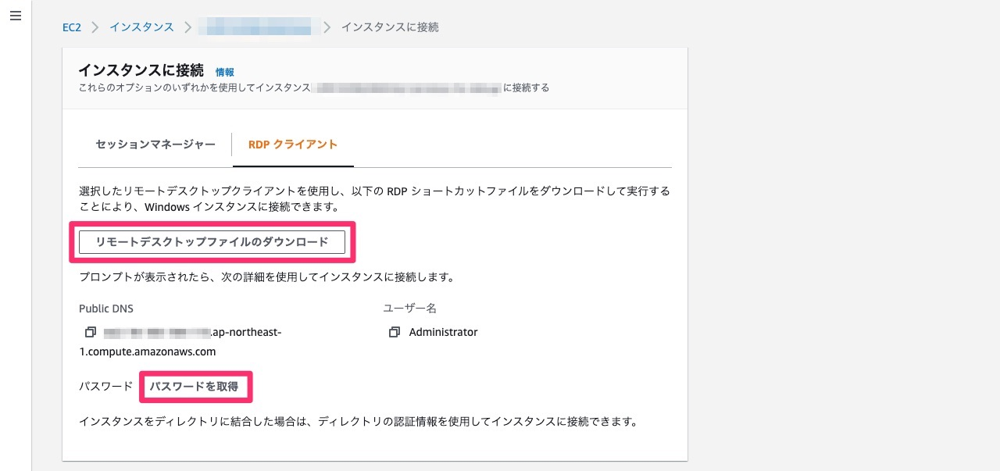

普段Macを使っているが、Webサービスの検証などでWindowsマシンが必要なときにどうするかのメモです。

## TL;DL

1. AWSなどのクラウドでWindowsインスタンス立ち上げ
1. リモートデスクトップでログイン
1. ngrok等のツールでローカルのアプリを公開

## 1. Windowsインスタンス立ち上げ

AWSやGCPなどのクラウドサービスでWindows Serverのインスタンスを起動します(スクショはAWSの例)。

インスタンスが起動したらRemote Desktopファイルをダウンロードできると思うので、ダウンロードしておきます。

パスワードはインスタンス起動時に指定した秘密鍵をアップロードすると取得できます。

## 2. リモートデスクトップでログイン

[Microsoft Remote Desktop](https://apps.apple.com/jp/app/microsoft-remote-desktop/id1295203466?mt=12)をインストールして、
先ほどダウンロードしたRemote Desktopファイルを開きます。

ユーザー名とパスワード入力を求められるので、先ほど控えた内容を入力するとWindowsにログインできます。

## 3. ローカルのアプリを公開

ローカルで開発中のWebアプリをリモートデスクトップ上のWindowsで確認したい場合、
[ngrok](https://ngrok.com/)等のツールを使ってローカルのポートを公開します。
公開されたURLにWindows上のブラウザからアクセスすればローカルのWebアプリを確認できます。

ちなみに似たようなツールで[cloudflared](https://github.com/cloudflare/cloudflared)というのがあります。
ngrokは無料だと同時に1ポートしか公開できませんが、cloudflaredは複数公開できるので自分は最近こちらを使います。
