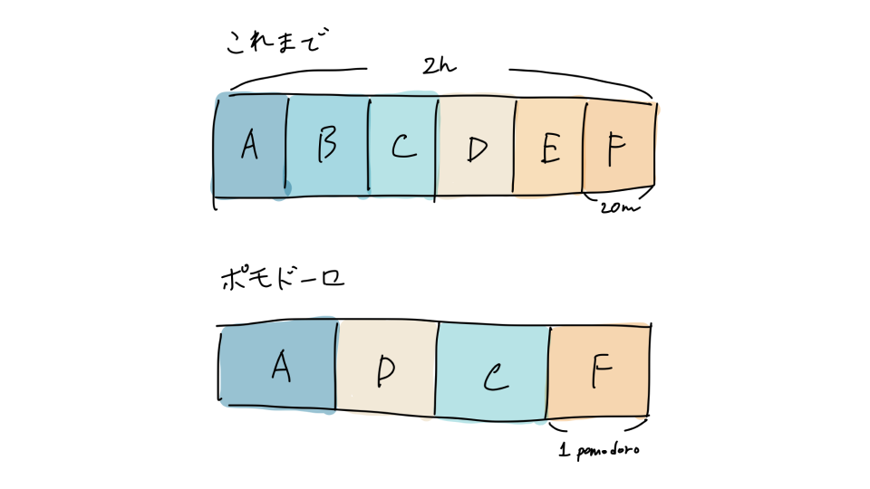

年始からポモドーロテクニックを使って仕事や勉強をするようにしてみました。始めてみて3週間ほどですが、意外と自分の性に合ってるなと感じています。

## そもそもポモドーロテクニックとは

[Wikipedia](https://ja.wikipedia.org/wiki/%E3%83%9D%E3%83%A2%E3%83%89%E3%83%BC%E3%83%AD%E3%83%BB%E3%83%86%E3%82%AF%E3%83%8B%E3%83%83%E3%82%AF)に必要十分な説明がありますが、25分などの一定時間タスクに集中して取り組んで、5分休憩、このサイクルをぐるぐる回すことでタスクをこなしていく時間管理術です。

自分は休憩時間は適当で、軽めのタスク用に27分(1ポモドーロ分)、設計やコーディングなど集中してやりたいタスク用に55分(2ポモドーロ分)の2つのタイマーを用意してやってます。

タイマーは「[集中](https://apps.apple.com/jp/app/%E9%9B%86%E4%B8%AD%E3%81%A8%E3%82%BF%E3%82%A4%E3%83%9E%E3%83%BC/id1387759250)」というアプリが良くて一時期使っていたのですが、タスクをやった時間や種別などのデータを自分で管理したくなったので、自分専用のWebアプリを適当に作ってそれを使っています。

## ポモドーロテクニックのメリット

「一定時間(25分間など)集中してタスクに取り組み、その後休憩というサイクルを繰り返すことで生産性が上がる」というのがポモドーロテクニックのよく謳われるメリットかと思いますが、個人的には「**1ポモドーロを何に使うかの取捨選択を強制される**」のが良いなと思っています。

たとえば、やりたいタスクがA,B,C,D,E,Fと6つあって時間が2時間あるとしたとき、1つ20分ずつやるのも良いですがポモドーロだとこのうち4つを選ぶことになります(1ポモドーロ25分くらいの場合)。

前者の方法だと、「前のタスクが押して後でやろうと思ってたことができなかった」、「色々やろうとして中途半端になった」ということが往々にしてあったのですが、ポモドーロだとやろうとしたタスクは必ず1ポモドーロ分時間を充てられます。

また、勉強や自己研鑽という意味では「1ポモドーロ = 1経験値」と考えると、経験値を何に割り振るかという話になるので、RPGなどのシミュレーションゲームをリアルでやっている感覚になりけっこう楽しく勉強できます。

|日付|数学|英語|読書|
|:--|--:|--:|--:|
|2021/01/21|1|1|2|
|2021/01/22|2|2|0|
|2021/01/23|2|4|2|

日毎に何に時間を使ったかを記録している

---

仕事や勉強のやり方というのは変えなくても困ったりしないし、あんまりこだわっても仕方ないよなと思ったりもしますが、新しいことを取り入れると思いもしなかった効果があったりと楽しいです。

2021年良いスタートを切れたように思います。
