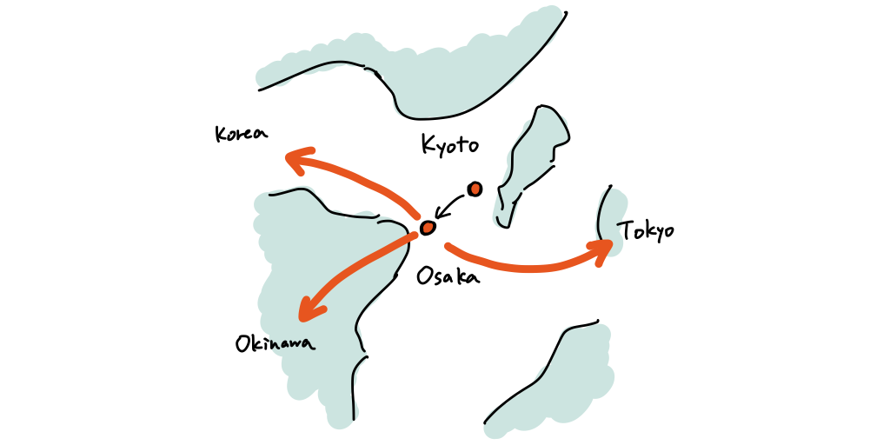

昨年末から1月末頃まで開催されていた[Booking.com Data Challenge](https://www.bookingchallenge.com/)という機械学習コンペに参加しました。 

## コンペの内容

ホテルや旅館の予約サービスを運営しているBooking.comが開催したコンペティションで、旅行客がその次に予約するであろう都市を予測するという課題でした。

具体例を使って説明すると、たとえば日本に来る旅行客について考えます。 この旅行客は旅行の最初の滞在先として京都の旅館を予約し、次に大阪のホテルを予約したとします。

このようにいくつかの予約がすでにあるという前提の基で、このコンペでは旅行客が次にどの都市のホテル・旅館を予約するかを予測するというのがゴールでした。 
この例だとたとえば東京や沖縄、韓国などが候補として上がってくるイメージです。

## コンペの結果

最終スコアを提出したチームが38チームで、自分はその中で21位でした。 
こういう機械学習のコンペに参加するのは初めてだったので、順位は下の方ですが完走できたのは良かったです。

最終的に採用した方法はオーソドックスなRecurrent Neural Networkで、気がついたら締め切りが来てしまったという感じで終わりました。 
もう少し時間があれば多少工夫はできたと思うので、提出したスコアには不満足な結果となってしまいました。

上位入賞者の手法はショートペーパーとして[ACM WSDM Workshop](https://web.ec.tuwien.ac.at/webtour21/)にて紹介されるそうです。 
いくつかのチームはすでに手法を公開してくれているので、自分でも試してみようと思います。

## おわりに

結果は芳しくありませんでしたが一通り提出までやってみて大変勉強になりました。 
意外とタイムマネジメント大事だなと思ったり、学習結果の管理等をちゃんとしないと混乱するなと思ったりしました(世のKagglerの人はすごいですね)。 
自分の研究にもダイレクトに活かせそうなので、今後も面白そうなコンペがあれば参加していきます。
