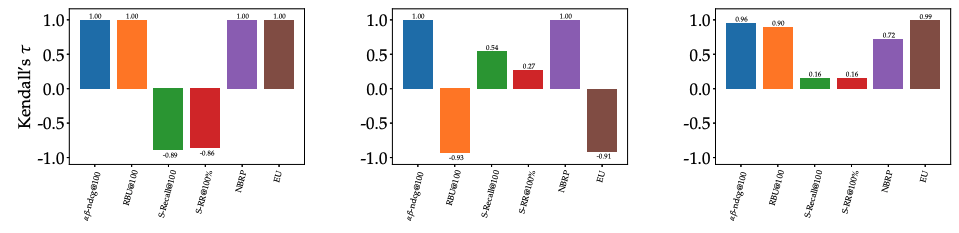
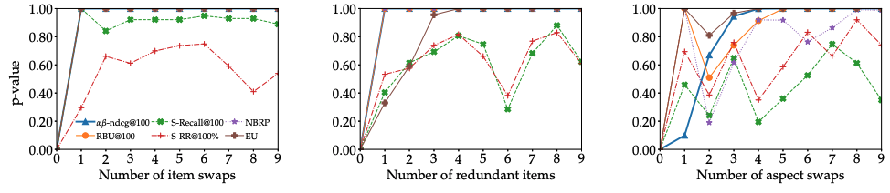
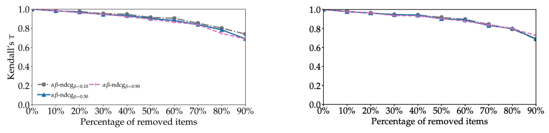

この記事は[情報検索・検索技術 Advent Calendar 2021](https://adventar.org/calendars/6430)の23日目の記事です． 
この記事では今年のRecSys[^1]で発表された「[Towards Unified Metrics for Accuracy and Diversity for Recommender Systems](https://dl.acm.org/doi/10.1145/3460231.3474234)」[^2]
という論文について紹介します．推薦タスクにおける精度と多様性を同時に測る統一的な指標を提案している論文で，実際の推薦システムでも最近は推薦の多様性の重要度が増してきていると思いますが，そういったことを考えるのにヒントになるかもしれません．なお，記事中の図はすべて論文からの引用になります．

## サマリー

- 推薦システムのための精度と多様性を同時に評価するための指標αβ-nDCGを提案しています．
- 指標を提案するにあたって，まず推薦システムにおける評価指標が満たすべき公理を考え，提案指標や先行研究で提案されてきた指標がそれらの公理を満たしているかどうかを検証しました．検証の結果，提案指標のみがすべての公理を満たすことを示しました．
- 実際の推薦タスクの実験で用いられるデータを使い，提案指標がオフライン実験において望ましい性質を有していることを確認しました．

## 研究背景

上位n件の推薦タスクにおける手法をオフラインで評価するとき，PrecisionやRecall, nDCGなどといった，情報検索の分野で培われた評価指標が今もよく使われます．

しかし，最近はこういった指標だけで手法の良し悪しを評価するのではなく，セレンディピティや新規性，多様性といった，適合・非適合以外の観点で手法を評価するニーズが出てきています．

こうした背景から，多様性などを測るための指標がこれまで提案されてはきましたが，研究者は適合率と多様性，どちらを最適化するかというジレンマに陥っていました．

そこで，この研究では多様性と精度の評価を統一した指標を提案することで，ジレンマの解決を試みています．

## 提案指標

著者らが提案する評価指標はαβ-nDCGというもので，多様性と精度を同時にいい塩梅に評価できる指標です．
論文の内容を事細かに説明しているととても長くなってしまうので，今回はまず指標の概要を掴んでもらうことを目的に，
詳細な議論は飛ばし，一部自分なりの解釈で補足を行いながら指標の説明をしていきたいと思います．

まずは提案指標の名称の中にある，nDCGという指標についての振り返りから入ります．

### nDCG

ほげ

### α-nDCG

ほげ

### αβ-nDCG

公理的分析

実験による分析

図1: ほげ

図2: ほげ

図3: ほげ

## 感想

ほげ

[^1]: 推薦システムに関する国際会議
[^2]: 本記事執筆時点ではオープンアクセスとなっており，誰でも読むことができます
