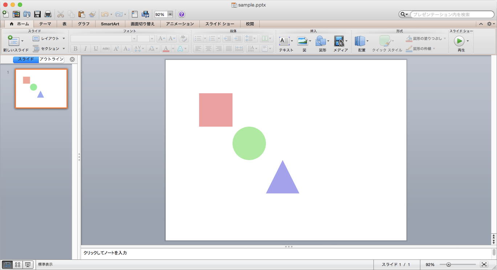

I introduce to create PowerPoint file by using Apache POI library today.
At this time, I'll use Maven for dependency management.

After you finish this tutorial,
you can create the following PowerPoint file automatically.



#### **Step 1**

To install POI libraries, add these dependencies to `pom.xml` like this.

```xml
<dependencies>
    <dependency>
        <groupId>org.apache.poi</groupId>
        <artifactId>poi</artifactId>
        <version>3.15</version>
    </dependency>

    <dependency>
        <groupId>org.apache.poi</groupId>
        <artifactId>poi-ooxml</artifactId>
        <version>3.15</version>
    </dependency>

    <dependency>
        <groupId>org.apache.xmlbeans</groupId>
        <artifactId>xmlbeans</artifactId>
        <version>2.6.0</version>
    </dependency>
</dependencies>
```

#### **Step 2**

Write some java code.

```java
package io.saitoxu.poisample;

import java.awt.Color;
import java.awt.Rectangle;
import java.io.File;
import java.io.FileOutputStream;

import org.apache.poi.sl.usermodel.ShapeType;
import org.apache.poi.xslf.usermodel.XMLSlideShow;
import org.apache.poi.xslf.usermodel.XSLFSimpleShape;
import org.apache.poi.xslf.usermodel.XSLFSlide;

public class App {
    public static void main(String[] args) throws Exception {
        XMLSlideShow ppt = new XMLSlideShow();
        XSLFSlide slide = ppt.createSlide();

        XSLFSimpleShape rect = slide.createAutoShape();
        rect.setShapeType(ShapeType.RECT);
        rect.setFillColor(new Color(200, 0, 0, 100));
        rect.setAnchor(new Rectangle(100, 100, 100, 100));

        XSLFSimpleShape oval = slide.createAutoShape();
        oval.setShapeType(ShapeType.ELLIPSE);
        oval.setFillColor(new Color(0, 200, 0, 100));
        oval.setAnchor(new Rectangle(200, 200, 100, 100));

        XSLFSimpleShape triangle = slide.createAutoShape();
        triangle.setShapeType(ShapeType.TRIANGLE);
        triangle.setFillColor(new Color(0, 0, 200, 100));
        triangle.setAnchor(new Rectangle(300, 300, 100, 100));

        File file = new File("sample.pptx");
        FileOutputStream out = new FileOutputStream(file);
        ppt.write(new FileOutputStream(file));
        ppt.close();
        out.close();
    }
}
```

#### **Step 3**

Finally, execute the above code, then you can find the PowerPoint file!
