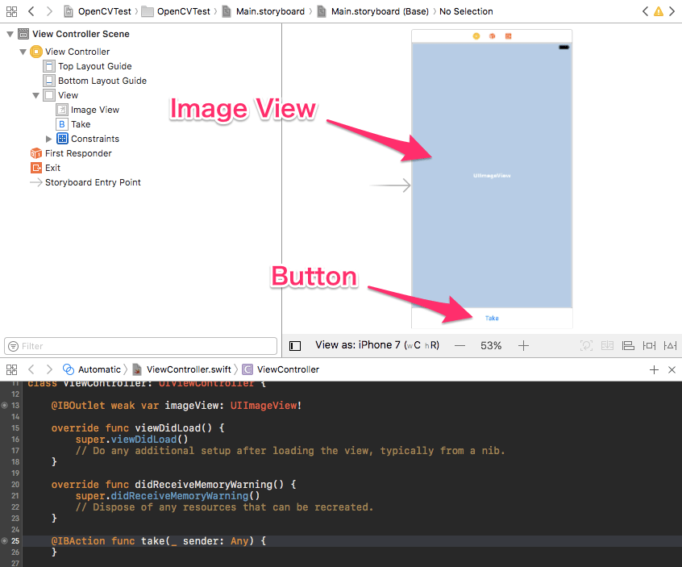

I try to use OpenCV library in Swift today.

Let's convert an picture by camera to a black-and-white image.

#### **Environment**

- iOS9.3.4
- Xcode8.1 (Swift3.0.1)
- OpenCV (3.1.0.1)

#### **Step 1**

First, create a project in Xcode,
and do `pod init` at the project top directory.

After that, edit `Podfile` like this.

```rb
platform :ios, '9.0'

target 'OpenCVTest' do
  use_frameworks!
  pod 'OpenCV'
end
```

And, install OpenCV library by `pod install` and open the project.

#### **Step 2**

Put an image view and a button on the first view.

The image view is for showing an image of camera,
and the button is for taking a shot.

After putting, storyboard is like this.



#### **Step 3**

Next, get the backside camera device,
and show its image in the image view you prepared.

```swift
// ViewController.swift
import UIKit
import AVFoundation

class ViewController: UIViewController, AVCaptureVideoDataOutputSampleBufferDelegate {

    @IBOutlet weak var imageView: UIImageView!

    var session : AVCaptureSession!
    var device : AVCaptureDevice!
    var output : AVCaptureVideoDataOutput!

    override func viewDidLoad() {
        super.viewDidLoad()
        // Do any additional setup after loading the view, typically from a nib.

        if initCamera() {
            session.startRunning()
        }
    }

    override func didReceiveMemoryWarning() {
        super.didReceiveMemoryWarning()
        // Dispose of any resources that can be recreated.
    }

    @IBAction func take(_ sender: Any) {
        // when button is tapped, this method is called
    }

    func initCamera() -> Bool {
        session = AVCaptureSession()
        session.sessionPreset = AVCaptureSessionPresetMedium

        let devices = AVCaptureDevice.devices()

        for d in devices! {
            if((d as AnyObject).position == AVCaptureDevicePosition.back){
                device = d as! AVCaptureDevice
            }
        }
        if device == nil {
            return false
        }

        do {
            let myInput: AVCaptureDeviceInput?
            try myInput = AVCaptureDeviceInput(device: device)

            if session.canAddInput(myInput) {
                session.addInput(myInput)
            } else {
                return false
            }

            output = AVCaptureVideoDataOutput()
            output.videoSettings = [ kCVPixelBufferPixelFormatTypeKey as AnyHashable: Int(kCVPixelFormatType_32BGRA) ]

            try device.lockForConfiguration()
            device.activeVideoMinFrameDuration = CMTimeMake(1, 15)
            device.unlockForConfiguration()

            let queue: DispatchQueue = DispatchQueue(label: "myqueue", attributes: [])
            output.setSampleBufferDelegate(self, queue: queue)

            output.alwaysDiscardsLateVideoFrames = true
        } catch let error as NSError {
            print(error)
            return false
        }

        if session.canAddOutput(output) {
            session.addOutput(output)
        } else {
            return false
        }

        for connection in output.connections {
            if let conn = connection as? AVCaptureConnection {
                if conn.isVideoOrientationSupported {
                    conn.videoOrientation = AVCaptureVideoOrientation.portrait
                }
            }
        }

        return true
    }

    func captureOutput(_ captureOutput: AVCaptureOutput!, didOutputSampleBuffer sampleBuffer: CMSampleBuffer!,
                       from connection: AVCaptureConnection!) {
        DispatchQueue.main.async(execute: {
            let image: UIImage = CameraUtil.imageFromSampleBuffer(buffer: sampleBuffer)
            self.imageView.image = image;
        })
    }
}
```

The last method, `captureOutput` is called in every frames,
and the argument, `sampleBuffer` has the data of camera.

Let's convert the data to image by creating the follwing util class,
and show it in `imageView`.

```swift
// CameraUtil.swift
import Foundation
import UIKit
import AVFoundation

class CameraUtil {
    class func imageFromSampleBuffer(buffer: CMSampleBuffer) -> UIImage {
        let pixelBuffer: CVImageBuffer = CMSampleBufferGetImageBuffer(buffer)!

        let ciImage = CIImage(cvPixelBuffer: pixelBuffer)

        let pixelBufferWidth = CGFloat(CVPixelBufferGetWidth(pixelBuffer))
        let pixelBufferHeight = CGFloat(CVPixelBufferGetHeight(pixelBuffer))
        let imageRect: CGRect = CGRectMake(0, 0, pixelBufferWidth, pixelBufferHeight)
        let ciContext = CIContext.init()
        let cgimage = ciContext.createCGImage(ciImage, from: imageRect )

        let image = UIImage(cgImage: cgimage!)
        return image
    }

    class func CGRectMake(_ x: CGFloat, _ y: CGFloat, _ width: CGFloat, _ height: CGFloat) -> CGRect {
        return CGRect(x: x, y: y, width: width, height: height)
    }
}
```

#### **Step 4**

Let's check temporarily.

If the camera image is shown in the image view,
then it means it works fine.

I'll write the left steps in the next post.
