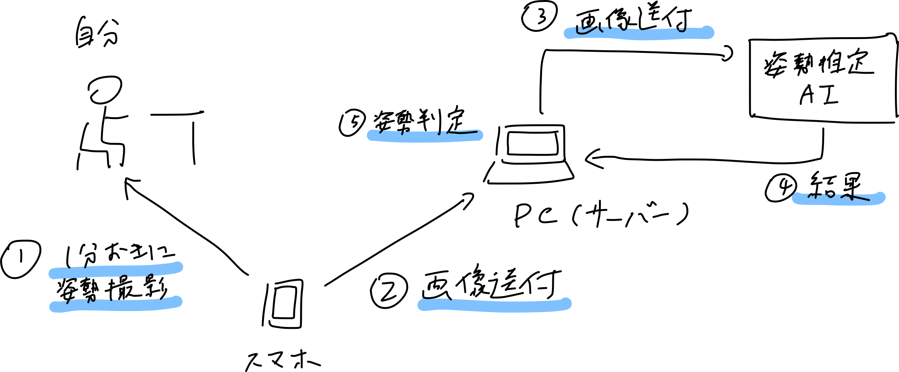
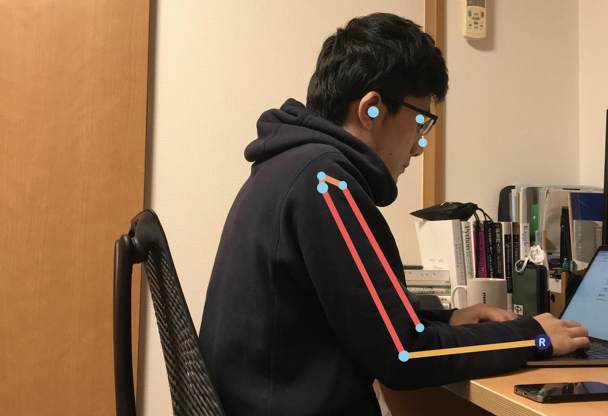

先日ユーザーローカル社が出した[姿勢推定AI](https://humanpose-ai.userlocal.jp/)が面白そうだったので試しに使ってみました。

## 姿勢推定AIについて

人物が写った画像を https://ai-api.userlocal.jp/human_pose にアップロードすると、画像中の人物の骨格のパーツの座標が返却されます。

```sh
$ curl https://ai-api.userlocal.jp/human_pose -F image_data=@path/to/image.jpg -F response_type=json > result.json
$ cat result.json | jq
{
  "image_data": "/9j/4AAQSkZJRgABAQAAAQA...",
  "result": {
    "person1": {
      "LElbow": [1788, 2485],
      "LEye": [1686, 714],
      "LShoulder": [1432, 1479],
      "Neck": [957, 1338],
      "Nose": [1601, 835],
      "REar": [1093, 472],
      "RElbow": [398, 2445],
      "REye": [1517, 613],
      "RShoulder": [517, 1298],
      "RWrist": [1229, 1942]
    }
  },
  "status": "ok"
}
```
使い方は[公式ドキュメント](https://humanpose-ai.userlocal.jp/human_pose/document)に詳しく書かれています。

## 姿勢矯正サービスを作ってみる

使い方は分かったので、これで座っている姿勢の矯正サービスを作ってみます。
先に言ってしまうと、途中までしか作れなかったのですが😅
構成はこんな感じです。

1. 1分おきに座っている姿勢をスマホで撮影
1. PCに撮影した画像を送付
1. サーバから姿勢推定AIに画像を送付
1. 推定結果を取得
1. 姿勢の良し悪しを判定



### カメラで撮影

最初にページを用意します。
[`MediaDevices.getUserMedia()`](https://developer.mozilla.org/ja/docs/Web/API/MediaDevices/getUserMedia)を使って、
スマートフォンのリアカメラを使います。
姿勢推定AIの回数制限は1時間につき100回なので、1分おきにカメラで撮影画像を取得しPCで稼働しているWebサーバに画像を送付します。

```html
<!DOCTYPE html>
<html>
  <head>
    <meta charset="UTF-8">
    <title>User Local Posture Correction</title>
    <style>
      canvas,
      video {
        border: 1px solid gray;
      }
    </style>
  </head>
  <body>
    <video id="camera" width="300" height="600"></video>
    <canvas id="picture" width="300" height="600"></canvas>
    <script>
      window.onload = () => {
        const video = document.querySelector('#camera')
        const canvas = document.querySelector('#picture')

        const constraints = {
          audio: false,
          video: {
            width: 300,
            height: 600,
            facingMode: { exact: 'environment' }
          }
        }

        function postData(data) {
          return fetch('/upload', {
            method: 'POST',
            mode: 'cors',
            cache: 'no-cache',
            headers: {
              'Content-Type': 'application/json'
            },
            redirect: 'follow',
            referrer: 'no-referrer',
            body: JSON.stringify({ data })
          }).then(response => response)
        }

        navigator.mediaDevices.getUserMedia(constraints)
          .then((stream) => {
            video.srcObject = stream
            video.onloadedmetadata = (e) => {
              video.play()
              const id = setInterval(() => {
                const ctx = canvas.getContext('2d');
                ctx.drawImage(video, 0, 0, canvas.width, canvas.height)
                const base64 = canvas.toDataURL('image/png')
                postData(base64)
                  .then(res => {
                    console.log(res)
                    clearInterval(id)
                  })
              }, 60000)
            }
          })
          .catch((err) => {
            console.log(err.name + ': ' + err.message)
          })
      }
    </script>
  </body>
</html>
```

### APIを使う

送付した画像を姿勢推定AIに送って結果を取得します。
今回はExpressを使って、送付された画像を姿勢推定AIに送ります。

```js
const express = require('express')
const app = express()
const bodyParser = require('body-parser')
const axios = require('axios')
const FormData = require('form-data')
const fs = require('fs')

app.use(bodyParser.urlencoded({ extended: true, limit: '10mb' }))
app.use(bodyParser.json({ extended: true, limit: '10mb' }))

app.use(express.static('public'))

app.post('/upload', function (req, res) {
  const base64 = req.body.data.replace(/^data:image\/png;base64,/, '')
  fs.writeFileSync('test.png', base64, 'base64')

  const formData = new FormData()
  formData.append('image_data', fs.createReadStream('test.png'))
  formData.append('response_type', 'json')

  axios
    .post('https://ai-api.userlocal.jp/human_pose', formData, {
      headers: formData.getHeaders()
    })
    .then(function(response) {
      console.log(response.data.result)
      console.log(response.data.result.person1)
      res.send('success')
    })
    .catch(err => {
      console.log(err.response)
      console.log(err.response.data)
      res.send('error')
    })
})

app.listen(3000, () => console.log('Listening on port 3000!'))
```

### 姿勢の良し悪しを判定

APIから得られた座標データをもとに、良い姿勢・悪い姿勢を判定します。
...と思ったのですが、姿勢推定AIでは姿勢の良し悪しを判定するのは難しそうでした。。
試しにAPIの`response_type`を`image`にして、座標の入った画像でどんなものか確認してみたのですが、
座標を取得できないケースが多く諦める結果となりました。


<p style="text-align: center">このように一部の座標が欠損するケースが多く姿勢判定が難しかった..</p>

デモ動画を見ると屋外やスポーツでの推定はうまくできていそうなので、
室内や動きのない姿勢というのがあまり得意でないのかもしれません。

## おわりに

途中で挫折する形になってしまいましたが、姿勢推定AIを使ってみました。
このように無償で面白いAPIを提供していただけるのはありがたいことなので、
また何かアイデアが思いついたら使ってみようと思います。
