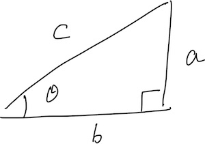
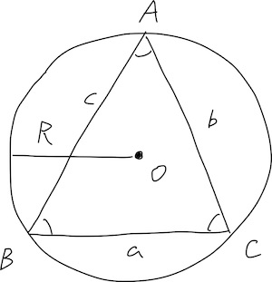

AtCoder Beginner Contest 168の[C問題](https://atcoder.jp/contests/abc168/tasks/abc168_c)で
余弦定理を使う必要があり、調べるのにけっこう時間使ったので関連する公式等を復習しておく。

ついでに[gatsby-remark-katex](https://www.gatsbyjs.org/packages/gatsby-remark-katex/)を導入してKaTeXで数式を書けるようにした。

## ラジアン・度数法の相互変換

ラジアンと度数単位は以下の関係になる。

$$
\pi\,\mathrm{rad}=180^\circ
$$

Pythonだと以下のように相互変換できる。

```py
import math

# ラジアン => 度数
print(math.degrees(math.pi / 2)) # => 90.0
print(math.degrees(math.pi / 3)) # => 59.99999999999999
print(math.degrees(math.pi / 6)) # => 29.999999999999996
# 度数 => ラジアン
print(math.radians(90) / math.pi) # => 0.5
print(math.radians(60) / math.pi) # => 0.3333333333333333
print(math.radians(30) / math.pi) # => 0.16666666666666666
```

## 三角関数の公式

### 三角関数



$$
\sin \theta=\cfrac{a}{c}, \cos\theta=\cfrac{b}{c}, \tan\theta=\cfrac{a}{b}
$$

Pythonでは以下のように扱う。

```py
import math

# sinを求める(引数はラジアン)
print(math.sin(math.pi / 2)) # => 1.0
# cos
print(math.cos(math.pi)) # => -1.0
# tan
print(math.tan(math.pi / 2)) # => 1.633123935319537e+16
# sinからラジアンを求める
print(math.asin(1.0) / math.pi) # => 0.5
# acos
print(math.acos(-1.0) / math.pi) # => 1.0
# atan
print(math.atan(1.0) / math.pi) # => 0.25
```

### 正弦定理



$$
\cfrac{a}{\sin A} = \cfrac{b}{\sin B} = \cfrac{c}{\sin C} = 2R
$$

### 余弦定理


$$
a^2 = b^2 + c^2 - 2bc \cos A
$$

$$
b^2 = c^2 + a^2 - 2ca \cos B
$$

$$
c^2 = a^2 + b^2 - 2ab \cos C
$$

### 加法定理

$$
\sin (\alpha \pm \beta) = \sin \alpha \cos \beta \pm \cos \alpha \sin \beta
$$

$$
\cos (\alpha \pm \beta) = \cos \alpha \cos \beta \mp \sin \alpha \sin \beta
$$

$$
\tan (\alpha \pm \beta) = \cfrac{\tan \alpha \pm \tan \beta}{1 \mp \tan \alpha \tan \beta}
$$
