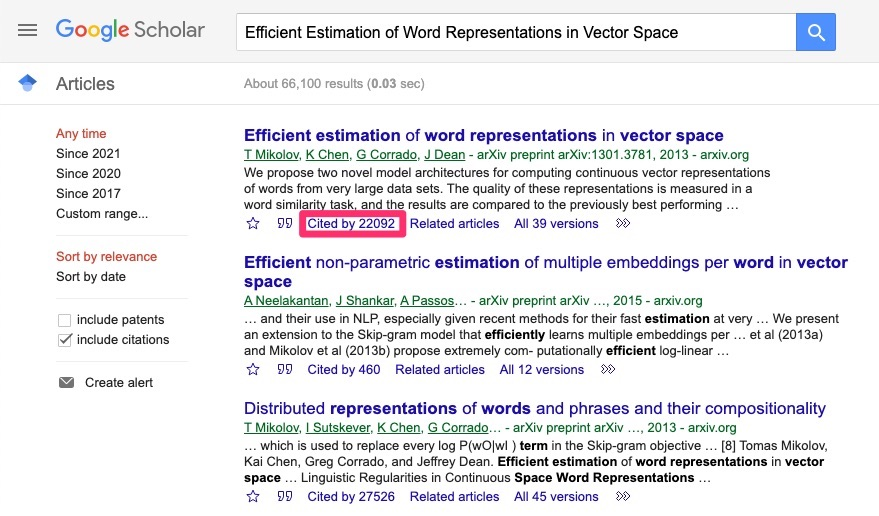
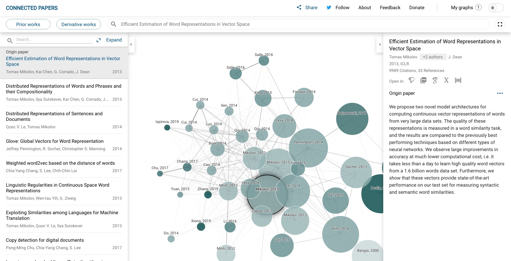

4月に博士後期課程に入学してから約2ヶ月が経ちました。 
今のところ基本的には自分の興味のある研究分野のサーベイをずっとやっていて、最近ようやく自分なりのやり方が固まってきたように思うので、今回はその方法を備忘録として書き残そうと思います。 
サーベイの流れとしては次の3ステップで、以下順に説明していきます。

1. 関連しそうな論文を探す
1. 論文を読んで内容をまとめる
1. 論文を整理し研究分野についてまとめる

## 1. 関連しそうな論文を探す

自分の場合、以下のような検索ツールを使って自分の研究分野に関連する論文を探します。

- [Google Scholar](https://scholar.google.com/)
- [dblp](https://dblp.org/)
- [Connected Papers](https://www.connectedpapers.com/)

Google Scholarは特に説明の必要はないと思います。 
九工大の井上先生による「[九工大・生命体の学生以外には見てほしくない論文のカン違い](https://docs.google.com/presentation/d/14L_0C9U6x5f1yXaGhPnMBpWmfAR7aalKe_AjIlWBvTg/edit?usp=sharing)(Googleスライド)」にはシステマチックに論文を検索する方法が書かれており、一読をおすすめします(論文の検索方法以外の意味でも役に立つことが多く書かれています)。 
Google Scholarで便利だなと思うのは、「この論文を引用している論文」を簡単に検索できることで、自分が着目している過去の研究がその後どのように発展していったのかを調べるのに重宝します。

Google Scholar: この論文を引用している論文が簡単に検索できる

調べたい会議や著者が決まっている場合はdblpが重宝します。Google Scholarは広く調査するのに使って、そのテーマで著名な研究者や注目すべき会議などが見つかってくればdblpを使って深堀りしていくというような使い分けをしています。

あとは時々Connected PapersというWebサービスも使います。これは論文名等で検索すると、その論文と関連する論文をグラフネットワークで表示してくれるものです。その論文が引用している重要な論文を調べ、その研究がどういう経緯で発展してきたのかを把握するのに使っています。

Connected Papers: 関連する論文が視覚的に分かる

## 2. 論文を読んで内容をまとめる

1のステップで、ある程度読むべき論文が溜まってきたら論文を読んでいきます。 
論文の読み方については以下のスライドがたいへん参考になりました。

- [研究分野をサーベイする](https://www.slideshare.net/iTooooooooooooT/itolab-how-to-survey-2017)(伊藤先生, お茶の水大)
- [論文に関する基礎知識2016](https://www.slideshare.net/tallzelkova/2015-61217994)(大槻先生, 筑波大)

まず論文のアブスト・結論・主要な図を読んで、思ったより関係がなさそう・手法のイメージがだいたいつく場合はそこで止め、そうでない場合は全文を読みます。 
論文管理は[Paperpile](https://paperpile.com/)を使っていて、論文を読むときは[GoodNotes](https://www.goodnotes.com/)に論文のpdfをインポートして読んでいます。Paperpileでも論文を読むことはできますが(そしてかなり使い勝手が良い)、GoodNotesは書くことに特化しており、メモのとりやすさが段違いなので、インポートする手間はありますがGoodNotesを使っています。

## 3. 論文を整理し研究分野についてまとめる

読んだ論文は、以下のような星取り表にまとめていきます。こうすることで、その研究分野の最近の傾向や、あまり研究されていない領域などが見えてきます。 
各行が論文で、列はどういう区分で論文をマッピングしたいかに依りますが、自分の場合問題設定の種類や、用いられている手法、評価の方法などが列になります。

|論文|問題設定1|問題設定2|手法1|手法2|
| :--- | :---: | :---: | :---: | :---: |
|A|○|-|○|-|
|B|-|○|-|○|
|C|○|-|-|○|

論文の星取表のイメージ

こうして論文をマッピングしていくと、また次に読みたい論文が出てくるので、1に戻って論文を探すという繰り返しになります。まぁ実際は説明したように明確にステップに区切られているわけではないですが、サーベイの流れとしてはこんな感じでやっています。

---

以上、自分なりのサーベイ方法の紹介でした。 
方法自体も日々勉強することだらけなので、今後大きく変わるようなことがあればまた書き留めたいと思います。
