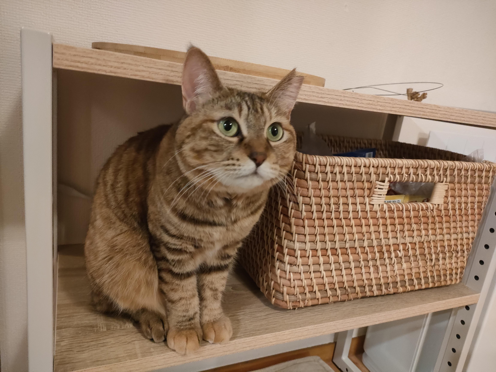

毎年恒例の今年の振り返り記事です。

## 会社

2016年末に創業した会社は今月で7期目に入りました。 
とりあえず6年間も会社が生き延びていることに驚き。

今年は、売上規模や社員数などの意味で拡大こそしたものの、
このままだと劇的な成長って見込めないよねとなり、秋口くらいから「今までのやり方を捨てて新しいやり方を模索する」ある意味混迷の年でもありました。 
今は新しいやり方も定まってきて、来年は各事業しっかり伸ばしていけるようなチームの雰囲気を感じています。

個人としては、今は主にGLITのエンジニアリング業務に注力しています。 
去年は開発業務の委譲とか言ってたんですが、真逆の方向性となり面白みを感じます。

あとはエンジニア採用も頑張っています。 
これも秋くらいから始めて、カジュアル面談からオファーを出すところまで一通りフローは作れたので良かったです（まだ内定承諾はないのでそこは来年頑張りたい）。

## 大学

博士課程2回生になりました。

1回生の頃から進めていた研究テーマを今年無事論文にまとめることができ、11月の国際会議で発表することができました。 
高々8ページの論文書くだけでめっちゃ大変やなと思いましたが、すごく良い経験になりました。

普段の業務だと60%の完成度で次々とタスクをこなしていくというスタイルになりがちで、
なかなかその完成度を70〜80%に上げていくということに時間をかけられないんですが、
逆に論文は完成度を上げることが重要なので、普段の業務とはまったく異なる脳が鍛えられるなという気がします。

あとは最初のアイデアが陳腐だったり曖昧だったりすると、最終的に論文として形にするのにかなり苦労するなと思いました。 
去年の研究テーマは今思うとけっこうありきたりなアイデアから始めたので、アイデアのピボットをしたりなど、方向修正を余儀なくされました。 
この辺はめちゃくちゃビジネスと通ずるものがあると思います。

今は前回の反省を活かし、もう少し質の高い（と自分で思っている）アイデアを基にしたテーマに取り組んでいるので、これも来年論文化したいです。

## プライベート

2月に保護猫を家族に迎え入れました。 
動物を飼うのは初めてなので最初は苦労しましたが、一緒にいる生活にももうだいぶ慣れてきました。 
可愛さ90%、憎さ10%といった感じです。

小虎（ことら）ちゃん（3歳♀）

## おわりに

短いですが今年の振り返りでした。 
2023年もよろしくお願いします。
